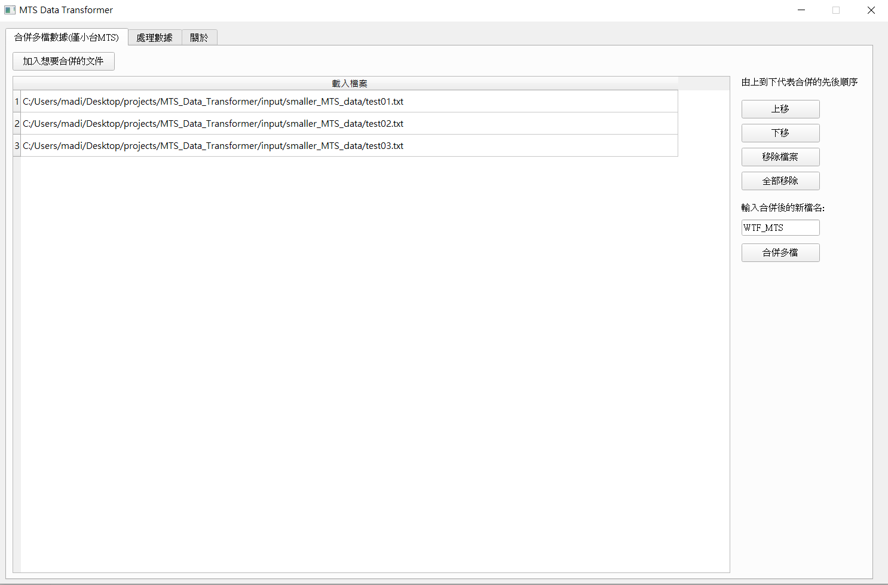
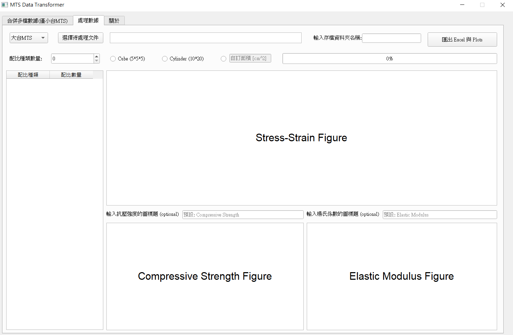
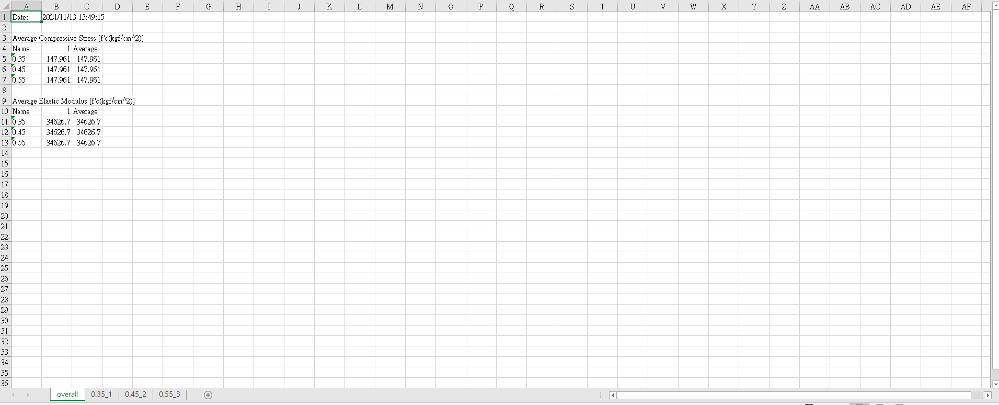
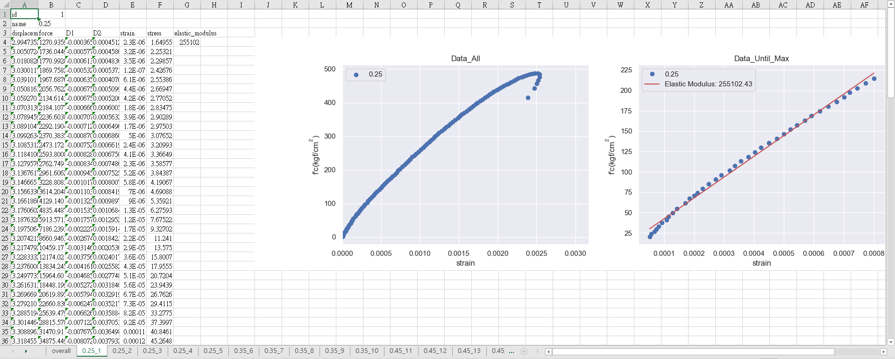

# MTS Specimens Data Transformer

Tutorial: https://github.com/DysonMa/MTS-Data-Transformer

> This program is designed for graduate students who are currently studying at the NTU CE 812 lab.

## What problem does this program solve?

> Traditionally, we use Excel as our data processing tool to calculate Elastic Modulus with linear regression, and find maximum compressive strength with functions in Excel manaully.
>
> Now, with this program, you can save the time of manual calculation and quickly get experimental data results by the code builded by PyQt5!

## Features

- Quickly calculate the results of all data and linear regression
- Simple and easy-to-use interface
- Error message box for any mistake
- use `logging` package to record log
- Export Excel with all the data and figures
- use `PyQt5.QThread` to create another thread to calculate time-consuming tasks without affecting the GUI
- user can choose smaller or bigger MTS type
- merge multiple files into a new file(only for smaller MTS)

## How to get it?

- use `git` command to clone this repo
- [Download as zip](https://github.com/DysonMa/MTS-Data-Transformer/archive/refs/heads/main.zip)

## Requirements

- Install Python first (3.5+ is good) --> https://www.python.org/downloads/
- This code use Python 3.8.5

## Packages

- matplotlib, seaborn
- pyqt5
- scipy
- openpyxl
- logging
- pyinstaller...

## Folder Structure

- `input`: input files comes from MTS
- `output`: all the datas and plots are listed in this folder according to the folder name you named
- `demo`: for demo pictures
- `src`
  - `main.py`: main code
  - `QtManager.py`: PyQt5 main controller
  - `DataManager.py`: Data processing
  - `PlotManager.py`: Plot figures and canvas
  - `ExcelManager.py`: Export Excel
  - `ThreadManager.py`: Schedule threads(long time
    task)
  - `Utilities.py`: Other utility functions
  - `MTS.ui`: UI file of appearance
  - `requirements.txt`: List all related packages and their versions
- `initialize.bat`
- `run.bat`

## How to use it?

> TL;DR:
>
> Click `initialize.bat` for the first time and click `run.bat` to start the journey!

1. Run `initialize.bat` for the first time to install all related packages (ONLY the first time)
2. Run `run.bat` to open the program (EVERY time)
3. Initial picture looks like this

   

4. (Optional) Select the tab of `合併多檔數據(僅小台MTS)`, and add the files to be merged, and arrange the order of the data, enter the file name, and click `合併多檔` to complete the merge. The merged txt just generated will be generated in the `/input/smaller_MTS_data/merged_txt_files` folder (all merged files in the future will be generated here)

    

5. click the tab of `處理數據`

    

5. Choose `大台MTS` or `小台MTS` and click `選擇待處理文件` button on the upper left of the window to choose any file from MTS

  - bigger MTS: only single file
  - smaller MTS: single file or multiple files are supported

   > Choose `WTF_MTS.txt` in the `/input/smaller_MTS_data/merged_txt_files` folder for smaller MTS demo

6. Key in a number for `配比種類數量` which means the number of ratio type

   > **<p.s> No blank fields allowed**

   The datas below are just for demo, DO NOT take it seriously ^0^:
   |配比種類|配比數量|
   |:--:|:--:|
   |0.35|1|
   |0.45|1|
   |0.55|1|

7. Choose specimen size (`Cube` or `Cylinder`) or you can key in a number in custom area

   > Choose `Cylinder` for demo

8. Key in a folder name in `輸入存檔資料夾名稱` field to save the output files

   > Enter `WTF_MTS_smaller` for demo

9. Click `匯出Excel與Plots` button to start the journey!

   

10. All the data and figures are stored in save folder, i.e. `WTF_MTS_smaller`

11. open `datas.xlsx`, you will see all the processed data, including the compressive strength, Elastic modulus and the loading history of each specimens.

    
    

## Contact

Feel free to contact me if needed

- Author: madihsiang (R07)
- Email: madihsiang@gmail.com

## Happy Experiment!
