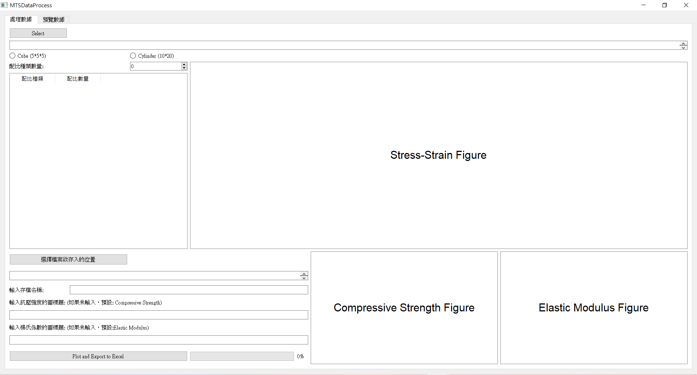
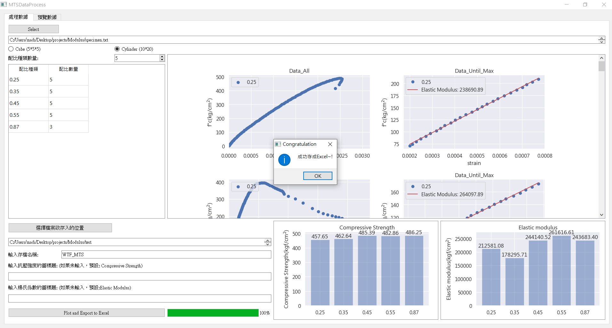

# MTS Specimens Data Tranformer

>This program is designed for graduate students who are currently studying at the NTU CE 812 lab.

## Environment

- You don't need to install Python to execute `ElasticModulus_Test-UI.exe`
- Both support Windows and Linux

## How to use it?

1. Open the exe in the `EM_Test_Final` folder
2. Click `ElasticModulus_Test-UI.exe` to start the program
3. Initial picture looks like this 

    

4. Click `Select` button on the upper left of the window to choose any file from MTS

    > Choose `specimen.txt` for demo

5. Choose specimen size(`Cube` or `Cylinder`)

    > Choose `Cylinder` for demo

6. Key in a number for `配比種類數量` which means the numbers of ratio type 

    > **<p.s> The value of this field must be the same as the number of `配比種類數量`** 

    The datas below are just for demo, DO NOT take it seriously ^0^: 
    |配比種類|配比數量|
    |:--:|:--:|
    |0.25|5|
    |0.35|5|
    |0.45|5|
    |0.55|5|
    |0.87|3|

7. Select a folder in `選擇檔案欲存入的位置` to save the output files

    > Select `test` folder for demo

8. Enter the save folder name in `輸入存檔名稱`
    > Enter `WTF_MTS` for demo

9. Click `Plot and Export to Excel` button to start the journey!

    

10. Change to `預覽數據` page for detail

    

11. All the datas and figures are stored in save folder, i.e. `WTF_MTS`

## Contact

It's not designed very well and still exist some bugs to fix, so feel free to contact me if needed

- Author: madihsiang
- Gmail: madihsiang@gmail.com

### Happy Experiment!