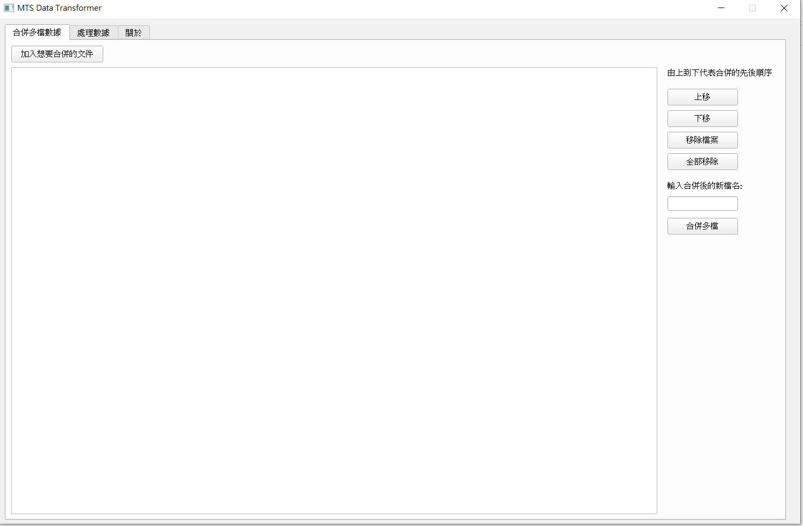
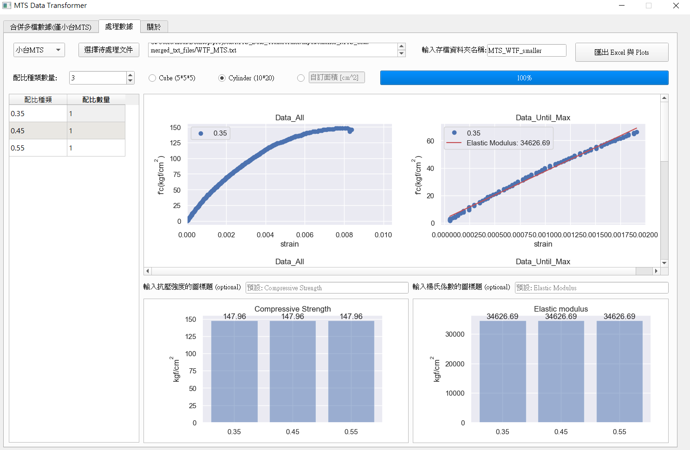

# MTS Specimens Data Transformer

> This program is designed for graduate students who are currently studying at the NTU CE 812 lab.

## What problem does this program solve?

> Traditionally, we use Excel as our data processing tool to calculate Elastic Modulus with linear regression, and find maximum compressive strength with functions in Excel manaully.
>
> Now, with this program, you can save the time of manual calculation and quickly get experimental data results by the exe builded by PyQt5!

## Features

- Quickly calculate the results of all data and linear regression
- Simple and easy-to-use interface
- Error message box for any mistake
- use `logging` package to record log
- Export Excel with all the data and figures
- use `PyQt5.QThread` to create another thread to calculate time-consuming tasks without affecting the GUI

## How to get it?

- use `git` command to clone this repo
- [Download as zip](https://github.com/DysonMa/MTS-Data-Transformer/archive/refs/heads/main.zip)

## Environment

- Install Python first --> https://www.python.org/downloads/
- Python 3.8.5
- You can also run `main.exe` to simply execute the program

## Packages

- matplotlib, seaborn
- pyqt5
- scipy
- openpyxl
- logging
- pyinstaller...

## Folder Structure

- `input`: input files comes from MTS
- `output`: All the datas and plots are listed in this folder according to the folder name you named
- `demo`: for demo pictures
- `src`
  - `main.py`: main code
  - `QtManager.py`: PyQt5 main controller
  - `DataManager.py`: Data processing
  - `PlotManager.py`: Plot figures and canvas
  - `ExcelManager.py`: Export Excel
  - `ThreadManager.py`: Schedule threads(long time task)
  - `Utilities.py`: other utility functions
  - `MTS.ui`: ui file for outlook
- `requirements`

## How to use it?

> TL;DR:
>
> Copy the `main.exe` and `MTS.ui` to any folder you want, and simply click the `main.exe` to start the journey!

1. `cd MTS_Data_Transformer`
2. create virtual env (optional) --> `virtaulenv venv` and `.\venv\Scripts\activate.bat`
3. `pip install -r requirements` (optional)
4. `python ./src/main.py` (optional) or simply click on `main.exe`
5. Initial picture looks like this

   

6. Click `選擇輸入文件` button on the upper left of the window to choose any file from MTS

   > Choose `specimen.txt` for demo

7. Key in a number for `配比種類數量` which means the number of ratio type

   > **<p.s> No blank fields allowed**

   The datas below are just for demo, DO NOT take it seriously ^0^:
   |配比種類|配比數量|
   |:--:|:--:|
   |0.25|5|
   |0.35|5|
   |0.45|5|
   |0.55|5|
   |0.87|3|

8. Choose specimen size (`Cube` or `Cylinder`) or you can key in a number in custom area

   > Choose `Cylinder` for demo

9. Key in a folder name in `輸入存檔資料夾名稱` field to save the output files

   > Enter `WTF_MTS` for demo

10. Click `匯出Excel與Plots` button to start the journey!

    

11. All the data and figures are stored in save folder, i.e. `WTF_MTS`

12. open `datas.xlsx`, you will see all the processed data, including the compressive strength, Elastic modulus and the loading history of each specimens.

## Contact

Feel free to contact me if needed

- Author: madihsiang (R07)
- Gmail: madihsiang@gmail.com

## Happy Experiment!
